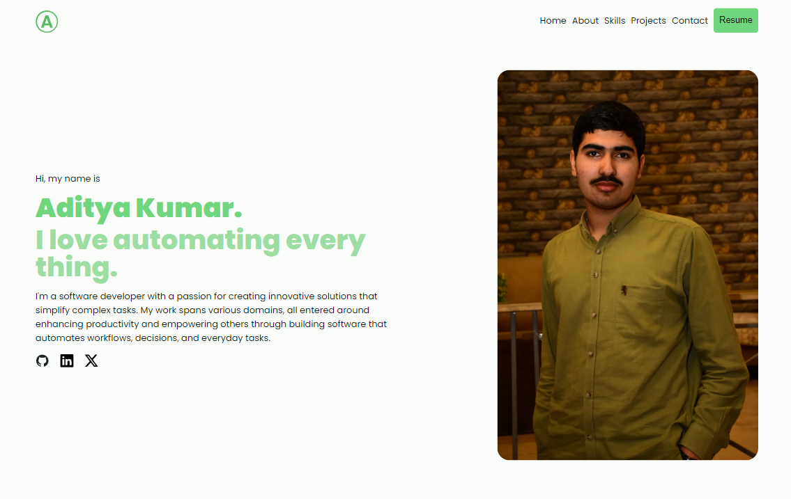

  

<h1 align="center">
  adityais.dev
</h1>

  My Personal Portfolio build with <a href="https://astro.build" target="_blank">Astro</a> and hosted
  with <a href="https://pages.github.com/" target="_blank">GitHub Pages</a>

# TL;DR

If you wish, you can fork this repo. Please give me proper credit by linking back to [adityais.dev](https://adityais.dev). Thanks!

# 🛠 Installation & Set Up

If you want to run this site locally, please refer to
[Astro Installation and Setup Guide](https://docs.astro.build/en/install-and-setup/)

## License

The Website is License under [GPL-3](./LICENSE), but the following directories/files

| Directory/File                                           | License                                                                              |
| -------------------------------------------------------- | ------------------------------------------------------------------------------------ |
| [`./src/content/*`](./src/content/)                      | [CC BY-NC 4.0](https://creativecommons.org/licenses/by-nc/4.0/?ref=chooser-v1)       |
| [`./src/assets/portrait.jpg`](./src/assets/portrait.jpg) | [CC BY-NC-ND 4.0](https://creativecommons.org/licenses/by-nc-nd/4.0/?ref=chooser-v1) |
| [`./public/resume.pdf`](./public/resume.pdf)             | [CC BY-NC-ND 4.0](https://creativecommons.org/licenses/by-nc-nd/4.0/?ref=chooser-v1) |
| [`./public/favicon.png`](./public/favicon.png)           | [CC BY-NC-ND 4.0](https://creativecommons.org/licenses/by-nc-nd/4.0/?ref=chooser-v1) |
| [`./public/favicon.svg`](./public/favicon.svg)           | [CC BY-NC-ND 4.0](https://creativecommons.org/licenses/by-nc-nd/4.0/?ref=chooser-v1) |
