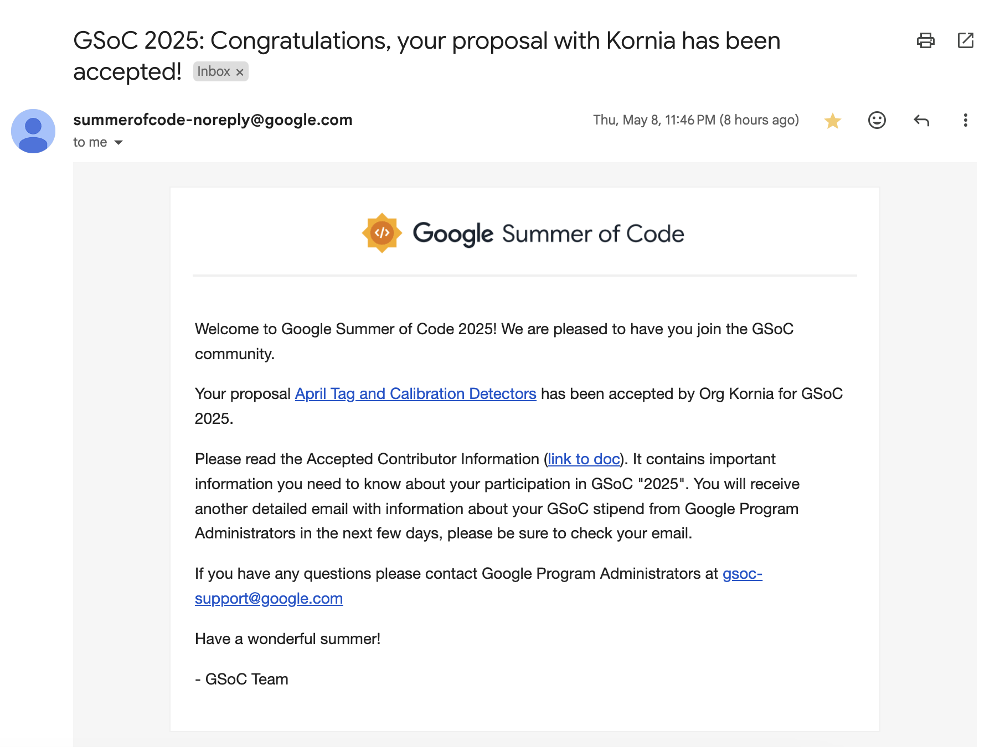

# I Got Selected for Google Summer of Code 2025

I'm excited to share you that I've been selected as a **Google Summer of Code 2025 (GSoC) contributor**
for [**kornia**](https://github.com/kornia/kornia-rs) — a Low-level 3D Computer Vision library in Rust.

## About the Project

During this summer I will be working on **April Tag and Calibration Detectors** with the goal
in mind to make them faster and efficient.

Here’s the official project summary:

> April Tags are widely used in robotics for precise localization, camera calibration,
> and augmented reality applications. Their ability to provide robust fiducial markers
> makes them valuable for tasks such as robot navigation, visual SLAM, and pose
> estimation. This project aims to implement efficient detection algorithms for both
> synthetic and natural features in Rust. It will include an April Tag detector—optimized
> for calibration and structured environments—and an ORB-based detector for natural
> feature extraction, which is crucial for robust visual localization and Visual SLAM
> applications. Both modules will be integrated into the kornia-rs ecosystem, thereby
> providing a comprehensive toolkit for camera calibration, localization, and robotics.

_If you’d like to explore more details, check out the [GSOC Project Page](https://summerofcode.withgoogle.com/programs/2025/projects/GZcYwnPE)_.

I’m incredibly thankful to my mentor [@edgarriba](https://github.com/edgarriba) and the
Kornia team for this opportunity, and I’m looking forward to diving deep into computer
vision, and robotics throughout the summer.

I’ll be sharing updates, insights, and learnings as I go — stay tuned for more!
